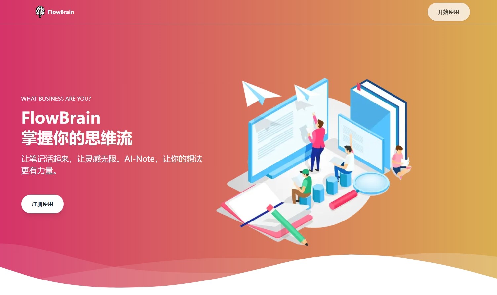
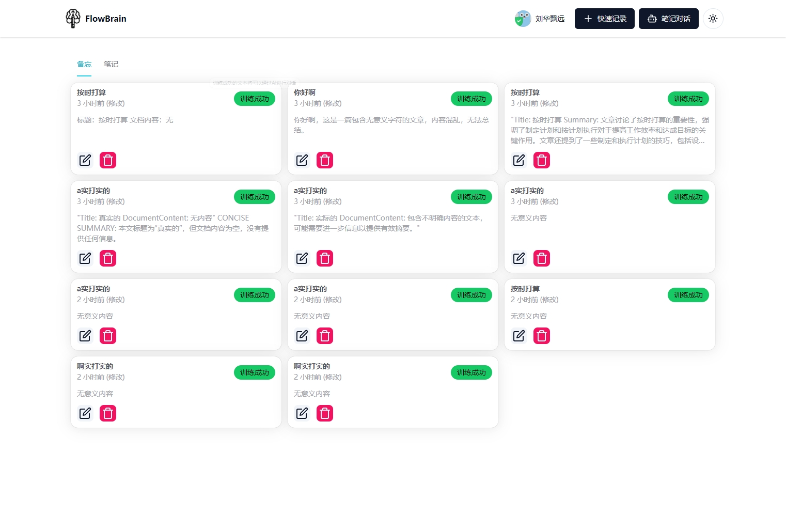

# Next.js 14 AI Note App

This is a note-taking app with an integrated **AI chatbot**. By using the **ChatGPT API**, **vector embeddings**, and **Pinecone**, the chatbot knows about all notes stored in your user account and can retrieve relevant information to answer your questions and summarize information.

**Response streaming** is implemented via the **Vercel AI SDK**.

The app is built with Next.js 14's app router, TailwindCSS, Shadcn UI, and TypeScript. It has a light/dark theme toggle and a fully mobile-responsive layout.

Learn how to build this app in my tutorial: https://www.youtube.com/watch?v=mkJbEP5GeRA

### 技术栈

- nextjs
- next-auth
- authing [authing](https://www.authing.cn/) ,casdoor
- pinecone [pinecone](https://www.pinecone.io/)
- chatgpt [chatgpt](https://www.chatgpt.ai/)
- langchain
- vercel-ai-sdk [vercel-ai-sdk](https://vercel.com/docs/vercel-ai/overview)

### 页面预览

### 1.1

##### 版本改用清华智普，注意向量数据库的维度要改成1024 , 注册地址：` https://open.bigmodel.cn`

- [x] 改善笔记列表显示
- [x] 增加笔记类型： 备忘，文章
- [x] 增加笔记类型：文章编写（AI编辑器长文本编辑器）
- [x] 增强文档训练，引入langchain，进行text split chunk , 并训练文档
- [x] 增加笔记状态，通过异步任务训练
- [x] 页面动态训练任务状态
- [x] 增加新的‘网站首页’
- [ ] 文档对话显示引用的文章段落
- [ ] 文档对话优化回调响应
- [ ] 训练任务，通过redis异步训练文档，并更新状态

### 1.0

- [x] next-auth集成，标准oidc集成
- [x] next-ui集成
- [x] 美化聊天对话记录
- [x] 美化聊天输入框
- [ ] 改善笔记列表显示
- [ ] 改善笔记录入体验，改为新开页面，markdown编辑器，可视化查看
- [ ] 增加笔记标签字段，并增加AI推荐标签
- [ ] 增加笔记分类，并增加分类功能

### 使用Docker进行编译和发布

- Dockerfile的编写
- docker build, docker tag, docker push
- docker-compose的编写
